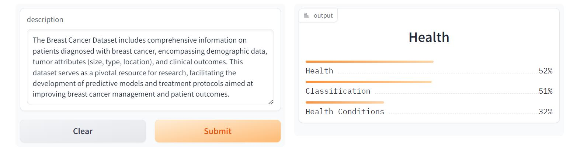

# Multilabel_Dataset_Category_Classifier
An end to end text classification model with data collection, model training,model compression and deployment. <br/>
This model can classify 103 different types of dataset types <br/>The keys of `deployment\category_types_encoded.json` shows the dataset category.<br>
To deploy this model, I used `distilroberta-base` huggingface model which is used for multilabel text classification. But, I also trained my model using `microsoft/deberta-base` and `bert-base-uncased` model with **96.20% Accuracy** with **5 epochs** and finally, I compared and deploy the best model for this project.
**N.B: the classes name used in the `scrapers\dataset_url_scraper.py` and  `scrapers\dataset_info_scraper.py` can be changed due to Kaggle's policy. It might be occurred to tackle the scraping.**

 ## Data Collection

Data was collected from [Kaggle Website](https://www.kaggle.com/datasets) <br/>The data collection process is divided into 2 steps:

1. **Dataset URL Scraping:** The dataset urls were scraped with `scrapers\dataset_url_scraper.py` and the urls are stored in `data\dataset_urls.csv`
2. **Dataset Info Scraping:** Using the urls, dataset title, description and categories are scraped with `scrapers\dataset_info_scraper.py` and they are stored in `data\dataset_info.csv`

In total, I scraped 20,942 dataset details.

## Data Preprocessing

After removing the duplicate urls and null values from the dataset the dataset transformed to 19,920 from 20,942. Initially there were *437* different categories in the dataset. After some analysis, I found out *334* of them are rare based on setting up the threshold which was 0.5% of the total length of the dataset. So, I removed those genres and then I have *103* categories. 

## Model Training

I finetuned a `distilrobera-base` model from HuggingFace Transformers using Fastai and Blurr. The model training notebook can be viewed `notebooks/distilroberta_modelTraining`

## Model Compression and ONNX Inference

The trained model has a memory of 315.5MB but I compressed this model using ONNX(Open Neural Network Exchange) quantization and brought it 78.8MB

## Model Comparison


## Why I did not choose DeBERTa and BERT Models?
As I used Google Colab for free that is why it did not not possible to train my model using these two models with proper learning rate as these two models take more memory than distilroberta-base and when I wanted to train my model using proper learning rate I got MemoryOutError in google colab..So, there might be overfitting issue using these models.Moreover, I got less train loss and valid loss for distilroberta-base model.Further, Distilled version of RoBERTa, meaning it’s smaller and faster to train,retains much of RoBERTa’s performance while being more resource-efficient, suitable for scenarios with limited computational resources. For these reasons, I decided to deploy `distilroberta-base` model.

## Model Deployment

The compressed model is deployed to HuggingFace Spaces Gradio App. The implementation can be found in `deployment` folder or [here](https://huggingface.co/spaces/Armanul/multilabel_dataset_classifier) 



## Web Deployment
Deployed a Flask App built to take descprition and show the categories as output. If the model recognize any category based on your provided description then it will return null value. Check `flask ` branch. The website is live [here](https://multilabel-dataset-classifier.onrender.com) 


## Build from the sources
`Python version 3.10 or 3.11 is required.`

To get started with the project, follow these steps:

1. Clone the project repository from GitHub

    ```powershell
    git clone https://github.com/armanulalam/multilabel_dataset_classifier.git
    ```

2. Set up the required dependencies and libraries by executing the following command:

    ```powershell
    pip install -r requirements.txt
    ```

3. Scraping the data.
   `scrapers/dataset_urls_scraper.py`
   `scrapers/dataset_info_scraper.py`
You will get the two csv files which are in `data` folder.

4. Train the model using the dataset by executing the following notebook: [disltilroberta_modelTraining.ipynb](notebooks/disltilroberta_modelTraining.ipynb).
5. Compress the model and ONNX(Open Neural Network Exchange) Inference by executing the following notebook: [ONNX_distilroberta.ipynb](notebooks/ONNX_distilroberta.ipynb)
6. Now, you can deploy the model by executing the following commands:

    ```powershell
    cd .\deployment\
    python app.py
    ```
7.To deploy the model using Flask app and Render server you need to switch `Flask` Branch. 

If you have any further query, do not hesitate to message me to armaanularmaan@gmail.com
